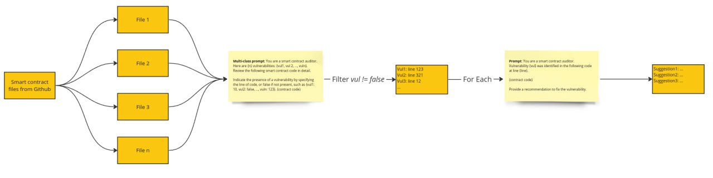

# AI Auditor
The aim of the AI Auditor service will be to make use of the abilities of AI to effectively synthesize and summarize information and return a valid audit report for a given smart contract function as well as a security score based on how secure the contract is. For this task, we will make use of an LLM to be able to analyze code and generate accurate vulnerability reports. The validity of the analysis arises from the fact that our chosen LLM will not only be provided with accurate appropriate context data during the analysis phases, but we will also fine-tune the model overtime after we see an increased number of smart contracts, and vulnerabilites detected by the AI are validated by real life auditors. This means we will be able to create a positive training feedback loop, where we would expect our LLM auditor to improve over time.

### Architecture 
Taking into consideration modern techniques to make LLMs more context aware and prevent hallucinations, as well as inspiration from this [academic research](https://arxiv.org/pdf/2310.01152),where an adversarial model is proposed, playing the roles of an AUDITOR and a CRITIC. In our case the goal is to replace the CRITIC agent with real-life security experts by gamefying the process of providing feedback and improving data quality. We also decided to implement a RAG - multiprompt LLM pipeline. A visual of this can be seen below:



Essentially, code coming in will be split into functions, and sent to the AI pipeline. From here, we will generate a vector embedding for the incoming code and use this embedding to search a vector database loaded with function examples from vulnerable and non-vulnerable smart contracts to provide context in our multi-prompt pipeline. From here we first query the LLM to generate vulnerability reports for the function. We use a structured output to prompt the LLM to analyze and report on the vulnerability detail, severity, impact and likelihood of the vulnerability. The vulnerability detail is then fed into a secondary LLM which is primarily tasked with providing recommendations on how these vulnerabilites can be mitigated. For the secondary prompt, we also make use of another vector similarity search so that we are able to give further context to our LLM about how the vulnerability is noramlly resolved. 

The idea behind splitting the prompting into multiple stages is to allow us to provide richer context at each step of the code analysis, and also to not overload the LLM with too much responisbility at any one stage, which would generally result in a higher level of hallucination due to the specificity of the task.

### RAG

We mentioned a couple of times above that we provide context to our prompts to improve the generated responses from our LLM. This is done through the use of a RAG, or Retrieval Augumented Generation. The idea behind this is that we will provide in our prompt, additional information releated to our query, in our case, for our first prompt, where we are trying to generate vulnerabilites for a function, we will will try to find similar pieces of code to the inputted user function, and give the AI appropriate examples of similar code and their vulnerabilites to the LLM in our prompt, allowing the LLM to make use of this context and identify a more relevant and accurate vulnerability (or none if the code does not have vulnerabilites) in its response. In our second prompt, where we aim to identify remediation steps, we instead search for similar vulnerability details and how these similiar vulnerabilites were remediated, and provide this "key:value" pair of vulnerability and remediation step as context in our query. 

**We have mentioned search a few times here, how is this done?** The search depends on the idea of vector embedding. We create a vector database of of both code examples, and vulnerability examples. In the code vector DB, we embed (which means we intelligently create a vector representation of our code) and store it in a DB with vulnerabilities related to that code (or lack thereof). Similarly we store an embedding of vulnerabilites and their remediation steps in another DB. During query, we generate an embedding of our user code, or identified vulnerability and compare this with the nearest vectors in our databse, essentially a similarity search. We then provide these results in our context.

### Prompt

Each prompt given to the AI tell the AI what its role is in our system (as a vulnerability detector or a remedy finder) and then provides the user code/vulnerability, appropriate context, and tells the LLM to return a structured output as a response. This is all done in the `manage.py` file. An example of a generated prompt can be seen below:
```
System: 
    You are a blockchain smart contract auditor. 
    You help users understand if their smart contracts have vulnerabilites or not.
    Given your own knowledge and context information, you will identify if a given function of code has vulnerabilites.
    Be specific in you analysis and reference the user's code when explaining why the code is vulnerable.
    You will need to identify start and end line number for the vulnerable user code as well as give a description of why the code is vulnerable.
    Please provide a list of discovered vulnerabilites.
    
Human: Analyze vulnerabilites in the smart contract code using the context below and your own knowledge.

Context:

Human: /// @notice Checks that the vin passed up is properly formatted
/// @dev Consider a vin with a valid vout in its scriptsig
/// @param \_vin Raw bytes length-prefixed input vector
/// @return True if it represents a validly formatted vin
function validateVin(bytes memory \_vin) internal pure returns (bool) {
    uint256 \_offset = 1;
    uint8 \_nIns = uint8(\_vin.slice(0, 1)[0]);

    // Not valid if it says there are too many or no inputs
    if (\_nIns >= 0xfd || \_nIns == 0) {
        return false;
    }

/// @notice Determines the length of an output
/// @dev 5 types: WPKH, WSH, PKH, SH, and OP\_RETURN
/// @param \_output The output
/// @return The length indicated by the prefix, error if invalid length
function determineOutputLength(bytes memory \_output) internal pure returns (uint256) {
    uint8 \_len = uint8(\_output.slice(8, 1)[0]);
    require(\_len < 0xfd, "Multi-byte VarInts not supported");

    return \_len + 8 + 1; // 8 byte value, 1 byte for \_len itself
}function findAndParseFundingOutput(
    DepositUtils.Deposit storage \_d,
    bytes memory \_txOutputVector,
    uint8 \_fundingOutputIndex
) public view returns (bytes8) {

function validateAndParseFundingSPVProof(
    DepositUtils.Deposit storage \_d,
    bytes4 \_txVersion,
    bytes memory \_txInputVector,
    bytes memory \_txOutputVector,
    bytes4 \_txLocktime,
    uint8 \_fundingOutputIndex,
    bytes memory \_merkleProof,
    uint256 \_txIndexInBlock,
    bytes memory \_bitcoinHeaders
) public view returns (bytes8 \_valueBytes, bytes memory \_utxoOutpoint){

function provideFraudBTCFundingProof(
    DepositUtils.Deposit storage \_d,
    bytes4 \_txVersion,
    bytes memory \_txInputVector,
    bytes memory \_txOutputVector,
    bytes4 \_txLocktime,
    uint8 \_fundingOutputIndex,
    bytes memory \_merkleProof,
    uint256 \_txIndexInBlock,
    bytes memory \_bitcoinHeaders
) public returns (bool) {

function provideBTCFundingProof(
    DepositUtils.Deposit storage \_d,
    bytes4 \_txVersion,
    bytes memory \_txInputVector,
    bytes memory \_txOutputVector,
    bytes4 \_txLocktime,
    uint8 \_fundingOutputIndex,
    bytes memory \_merkleProof,
    uint256 \_txIndexInBlock,
    bytes memory \_bitcoinHeaders
) public returns (bool) {

function provideSPVFraudProof(
    DepositUtils.Deposit storage \_d,
    bytes4 \_txVersion,
    bytes memory \_txInputVector,
    bytes memory \_txOutputVector,
    bytes4 \_txLocktime,
    bytes memory \_merkleProof,
    uint256 \_txIndexInBlock,
    uint8 \_targetInputIndex,
    bytes memory \_bitcoinHeaders
) public {

Description: There is no explicit restriction on the number of inputs and outputs a Bitcoin transaction can have - as long as the transaction fits into a block. The number of inputs and outputs in 
a transaction is denoted by a leading “varint” - a variable length integer. In BTCUtils.validateVin and BTCUtils.validateVout, the value of this varint is restricted to under 0xFD, or 253:bitcoin-spv/solidity/contracts/BTCUtils.sol:L404-L415Transactions that include more than 252 inputs or outputs will not pass this validation, leading to some legitimate deposits being rejected by the tBTC system. Examples: The 252-item limit exists in a few forms throughout the system, outside of the aforementioned BTCUtils.validateVin and BTCUtils.validateVout:bitcoin-spv/solidity/contracts/BTCUtils.sol:L294-L303tbtc/implementation/contracts/deposit/DepositUtils.sol:L150-L154tbtc/implementation/contracts/deposit/DepositUtils.sol:L181-L191tbtc/implementation/contracts/deposit/DepositFunding.sol:L213-L223tbtc/implementation/contracts/deposit/DepositFunding.sol:L263-L273tbtc/implementation/contracts/deposit/DepositLiquidation.sol:L150-L160

/\*\*
\* @notice Checks whether a transaction is "standard finalized"
\* @dev MVP: requires that both inclusion proof and confirm signature is checked
\* @dev MoreVp: checks inclusion proof only
\*/
function isStandardFinalized(Model.Data memory data) public view returns (bool) {
    if (data.protocol == Protocol.MORE\_VP()) {
        return checkInclusionProof(data);
    } else if (data.protocol == Protocol.MVP()) {
        revert("MVP is not yet supported");
    } else {
        revert("Invalid protocol value");
    }
}/\*\*
\* @notice Checks whether a transaction is "protocol finalized"
\* @dev MVP: must be standard finalized
\* @dev MoreVp: allows in-flight tx, so only checks for the existence of the transaction
\*/
function isProtocolFinalized(Model.Data memory data) public view returns (bool) {
    if (data.protocol == Protocol.MORE\_VP()) {
        return data.txBytes.length > 0;
    } else if (data.protocol == Protocol.MVP()) {
        revert("MVP is not yet supported");
    } else {
        revert("Invalid protocol value");
    }
}function checkInclusionProof(Model.Data memory data) private view returns (bool) {
    if (data.inclusionProof.length == 0) {
        return false;
    }

    (bytes32 root,) = data.framework.blocks(data.txPos.blockNum());
    bytes32 leafData = keccak256(data.txBytes);
    return Merkle.checkMembership(
        leafData, data.txPos.txIndex(), root, data.inclusionProof
    );
}function verifyAndDeterminePositionOfTransactionIncludedInBlock(
    bytes memory txbytes,
    UtxoPosLib.UtxoPos memory utxoPos,
    bytes32 root,
    bytes memory inclusionProof
)
    private
    pure
    returns(uint256)
{
    bytes32 leaf = keccak256(txbytes);
    require(
        Merkle.checkMembership(leaf, utxoPos.txIndex(), root, inclusionProof),
        "Transaction is not included in block of Plasma chain"
    );

    return utxoPos.value;
}require(controller.txFinalizationVerifier.isStandardFinalized(finalizationData), "In-flight transaction not finalized");

require(self.txFinalizationVerifier.isStandardFinalized(finalizationData), "Failed to verify the position of competing tx");

require(exitData.controller.txFinalizationVerifier.isStandardFinalized(finalizationData),
        "Input transaction is not standard finalized");

Description: TxFinalizationVerifier is an abstraction around the block inclusion check needed for many of the features of plasma exit games. It uses a struct defined in TxFinalizationModel as inputs to its two functions: isStandardFinalized and isProtocolFinalized.isStandardFinalized returns the result of an inclusion proof. Although there are several branches, only the first is used:code/plasma_framework/contracts/src/exits/utils/TxFinalizationVerifier.sol:L19-L32isProtocolFinalized is unused:code/plasma_framework/contracts/src/exits/utils/TxFinalizationVerifier.sol:L34-L47The abstraction used introduces branching logic and requires several files to be visited to fully understand the function of each line of code: ITxFinalizationVerifier, TxFinalizationModel, TxPosLib, Protocol, BlockController, and Merkle. Additionally, the abstraction obfuscates the underlying inclusion proof primitive when used in the exit game contracts. isStandardFinalized is not clearly an inclusion proof, and isProtocolFinalized simply adds confusion.Finally, the abstraction may have ramifications on the safety of Merkle.sol. As it stands now, Merkle.checkMembership should never be called 
directly by the exit game controllers, as it lacks an important check made in TxFinalizationVerifier.checkInclusionProof:code/plasma_framework/contracts/src/exits/utils/TxFinalizationVerifier.sol:L49-L59By introducing the abstraction of TxFinalizationVerifier, the input validation performed by Merkle is split across multiple files, and the reasonable-seeming decision of calling Merkle.checkMembership directly becomes unsafe. In fact, this occurs in one location in the contracts:code/plasma_framework/contracts/src/exits/payment/controllers/PaymentChallengeIFENotCanonical.sol:L187-L204 

function Verify(bytes memory proof, uint256[] memory public_inputs)

Description: The Verify function has the following signature:Here, proof is a dynamically sized array of bytes (padded upto the nearest word). The function derive_gamma(aproof, pub_inputs) uses this array and makes some assumptions about its length. Specifically, that it is (vk_nb_commitments_commit_api * 3 * 0x20) + 0x360 bytes long (when including the initial length field of the bytes array). However, there is no check that the proof supplied in the calldata (which originates within ZkEvmV2 where it is loaded into memory) has the correct length. This could result in the proof and pub_inputs overlapping in memory, leading to unintended consequences.Also, if mistakenly appended extra bits to the proof, it will not affect the proof verification as the Verifier doesn’t account for any extra bits after the y coordinate of the last commitment. But it will surely make the verification expensive, as it will still be copied down into memory.

external view override returns (bytes memory context, uint256 deadline) {
(requiredPreFund);
bytes32 hash = getHash(userOp);

PaymasterData memory paymasterData = userOp.decodePaymasterData();
uint256 sigLength = paymasterData.signatureLength;

//ECDSA library supports both 64 and 65-byte long signatures.
// we only "require" it here so that the revert reason on invalid signature will be of "VerifyingPaymaster", and not "ECDSA"
require(sigLength == 64 || sigLength == 65, "VerifyingPaymaster: invalid signature length in paymasterAndData");
require(verifyingSigner == hash.toEthSignedMessageHash().recover(paymasterData.signature), "VerifyingPaymaster: wrong signature");
require(requiredPreFund <= paymasterIdBalances[paymasterData.paymasterId], "Insufficient balance for paymaster id");
return (userOp.paymasterContext(paymasterData), 0);
}

Paymaster ETH can be drained with malicious sender

function execute(bytes calldata input) external override {
(bytes memory data, bytes memory proof) = abi.decode(input, (bytes, bytes));

function _validateSignatures(
bytes32 messageHash,
address[] memory operators,
if (operatorsEpoch == 0 || epoch - operatorsEpoch >= OLD_KEY_RETENTION) revert InvalidOperators();

_validateSignatures(messageHash, operators, weights, threshold, signatures);
Previous {Operators/Weights/Threshold} Are Still Able To Sign Off New Commands After Operatorship Is Transferred


Human: Please analyze the following smart contract code for vulnerabilites:

Human: function verify(
    bytes calldata inputTxBytes,
    uint16 outputIndex,
    uint256 inputTxPos,
    bytes calldata spendingTxBytes,
    uint16 inputIndex,
    bytes calldata signature,
    bytes calldata /\*optionalArgs\*/
)
    external
    view
    returns (bool)
{
    PaymentTransactionModel.Transaction memory inputTx = PaymentTransactionModel.decode(inputTxBytes);
    require(inputTx.txType == supportInputTxType, "Input tx is an unsupported payment tx type");

    PaymentTransactionModel.Transaction memory spendingTx = PaymentTransactionModel.decode(spendingTxBytes);
    require(spendingTx.txType == supportSpendingTxType, "The spending tx is an unsupported payment tx type");

    UtxoPosLib.UtxoPos memory utxoPos = UtxoPosLib.build(TxPosLib.TxPos(inputTxPos), outputIndex);
    require(
        spendingTx.inputs[inputIndex] == bytes32(utxoPos.value),
        "Spending tx points to the incorrect output UTXO position"
    );

    address payable owner = inputTx.outputs[outputIndex].owner();
    require(owner == ECDSA.recover(eip712.hashTx(spendingTx), signature), "Tx in not signed correctly");

    return true;
}
```
As you can see, we have:
- System level prompt telling the LLM what it needs to achieve
- Context information
- The user submitted function
  
An example of our structured output for identifying vulnerabilites is seen below:
```python
vulnerabilites=[Vulnerability(start_line=0, end_line=0, detail="The function does not validate the length of the 'signature' parameter, which could lead to potential vulnerabilities such as buffer 
overflow or memory corruption if an excessively long signature is provided.", severity=<Severity.medium: 'medium'>, title='Missing Length Validation for Signature Parameter')]
```

### Data collection
A major part of the project was data collection and cleaning. The better the data we provide our model, the better the results we can expect to receive from the model. An extensive data collection task was carried out, where we scraped a multitude of smart contract vulnerabilites from platforms such as github, smart contract audit reports and solidit. The `datamining.py` file highlights this process, where we accurately were able to web scrape code examples. There are also a number of custome scraping classes that we ended up writing to allow us to effectively scrape, and clean data from Solidit and Github vulnerability reports. 

### Bias
By providing both vulnerable and non-vulnerable pieces of code to our model, we are able to prevent the model from biasing itself towards always detecting vulnerabilites. If in some cases, we see that our code is most similar to secure code, we will instead generate responses saying that the user's code is not vulnerable.

### Evolution Model
The benefit of our AI and real human involvement means that we can continually imporve our AI model over time. This is achieved by collecting and batch training data, which can then be fed back to the LLM to train it over time. The batch training data will consist of human auditor verified vulnerabilites. We not only add these documents instantly back into our RAG system (by embedding the information and adding it to the relevant vector stores), but we also over time will use these collected vulnerabilites to fine-tune our AI model. This means that we expect our model to continue to evolve and eventually arrive at a state where it consistently detects accurate vulnerabilites without any human intervention.

### Deployment
The model was also deployed and made available to interact with using Docker and the following [API endpoints](http://34.207.219.122/docs)
